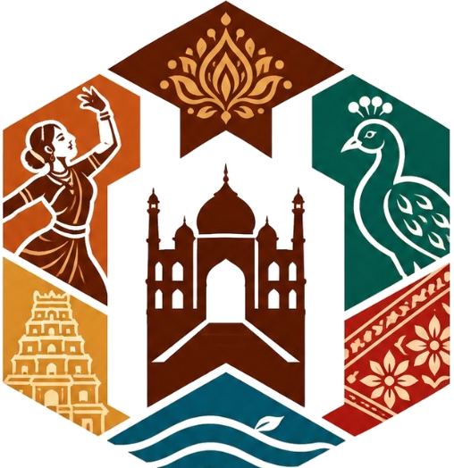

# 🏛️ VIRASAT — The Heritage of India

> _An interactive cultural journey through India's living heritage — discover the traditions, stories, festivals, art, music, food, and regional identities that make every state unique._



---

## 📌 About

**Virasat** (विरासत — meaning "heritage" in Hindi) is a richly designed, immersive web experience that invites users to explore India's diverse cultural landscape. From royal Rajasthani forts to Dravidian temple architecture, from Bharatanatyam to Bihu — Virasat brings living traditions to the screen through an interactive cultural atlas, curated heritage cards, multilingual greetings with voiceovers, and ambient soundscapes.

---

## ✨ Key Features

| Feature | Description |
|---|---|
| **Cinematic Landing Page** | Full-screen Red Fort hero with particle effects, layered depth overlays, parallax scrolling, and a parchment-gold design language |
| **Interactive Cultural Atlas** | India map with clickable/hoverable regional hotspots, zone-based filtering (North, South, East, West, Central, Northeast), and animated popover region cards |
| **Multilingual Greeting Avatars** | Namaste avatar with speech bubble that cycles through 5 regional greetings (Hindi, Tamil, Bengali, Marathi, Assamese) in native scripts |
| **🔊 Avatar Voiceovers** | Tap-to-listen voiceover on avatar greetings using the Web Speech Synthesis API with language-appropriate voices |
| **Featured Heritage Cards** | Curated image cards showcasing Classical Dance, Ancient Temples, Folk Festivals, and Regional Cuisine |
| **Cultural Facts Ticker** | "Did You Know?" section with auto-rotating curated facts about India's intangible heritage |
| **Live Search** | Real-time search across regions, cultural categories, and highlights with a dropdown results panel |
| **Ambient Soundscape** | Toggleable Tanpura drone ambience for an immersive cultural atmosphere |
| **Journey Progress Tracker** | Gamified exploration tracker showing regions discovered and heritage explorer rank |
| **User Profile Dropdown** | Profile panel with journey statistics and preferences |
| **Regional Exploration Pages** | Dedicated `explore.html` with region-specific deep dives (pilot regions: Rajasthan, Maharashtra, Tamil Nadu) |
| **Auth Modal** | Landing page sign-in / sign-up modal with guest entry option |
| **Responsive Design** | Mobile-first responsive layouts across all pages |

---

## 🗂️ Project Structure

```
Virasat/
├── index.html          # Landing Page — cinematic hero, auth modal, project overview
├── home.html           # Home Page — interactive cultural atlas & exploration hub
├── explore.html        # Regional Exploration — deep-dive into a selected region
│
├── style.css           # Global design system + Landing Page styles
├── home.css            # Home Page-specific styles (atlas, avatar, cards, etc.)
│
├── app.js              # Landing Page controller (auth, parallax, particles, audio)
├── home.js             # Home Page controller (map, search, greetings, voiceover)
├── data.js             # Central cultural data repository (regions, facts, search index)
│
└── assets/
    ├── emblem_clean.png           # Virasat emblem (favicon & branding)
    ├── emblem_transparent.png     # Transparent emblem variant
    ├── logo_source.jpg            # Source logo file
    ├── logo_transparent.png       # Transparent logo
    ├── typography_clean.png       # Brand typography asset
    ├── typography_transparent.png # Transparent typography variant
    ├── red_fort_source.png        # Red Fort hero background
    ├── india_map_cultural.jpg     # Cultural map of India (interactive atlas)
    ├── namaste_avatar.jpg         # Namaste greeting avatar
    ├── featured_dance.jpg         # Featured: Classical Dance
    ├── featured_temples.jpg       # Featured: Ancient Temples
    ├── featured_festivals.jpg     # Featured: Folk Festivals
    └── featured_cuisine.jpg       # Featured: Regional Cuisine
```

---

## 🎨 Design System

### Color Palettes

| Palette | Usage | Key Colors |
|---|---|---|
| **Hero / Cinematic** | Landing page hero section | Deep maroon, midnight, gold, warm ivory |
| **Earthy India** | Main application UI | Terracotta `#97572C`, Olive `#585334`, Gold `#D4AF37`, Cream `#FBF7EF` |

### Typography

| Font | Usage |
|---|---|
| **Cinzel Decorative** | Brand name "VIRASAT" |
| **Cinzel** | Section headings, heritage titles |
| **Rozha One** | Decorative accents, Devanagari headers |
| **Plus Jakarta Sans** | Body text, UI labels, navigation |
| **Cormorant Garamond** | Quotes, italic accents |

### Design Tokens

- Spacing: `--space-xs` through `--space-3xl`
- Border radii: `--radius-sm`, `--radius-md`, `--radius-lg`, `--radius-full`
- Shadows: `--ei-shadow-sm`, `--ei-shadow-md`, `--ei-shadow-lg`
- Transitions: `--transition-fast` (0.2s), `--transition-smooth` (0.4s)

---

## 🗺️ Page Flow

```
┌─────────────────┐     "Begin Journey"     ┌─────────────────┐     "Explore Region"     ┌─────────────────┐
│   index.html    │ ──────────────────────►  │   home.html     │ ──────────────────────►  │  explore.html   │
│  Landing Page   │     (Auth / Guest)       │  Cultural Atlas  │    (?region=xxx)         │  Region Deep    │
│                 │                          │                 │                          │  Dive           │
└─────────────────┘                          └─────────────────┘                          └─────────────────┘
```

---

## 🚀 Getting Started

### Prerequisites

- A modern web browser (Chrome, Firefox, Edge, Safari)
- No build tools, frameworks, or package managers required

### Run Locally

1. **Clone the repository**
   ```bash
   git clone https://github.com/mahek02007/Virasat.git
   cd Virasat
   ```

2. **Open in browser**
   - Use a local dev server for the best experience:
     ```bash
     # Using Python
     python -m http.server 8000

     # Using ReactJs
     npm run dev

     # Using VS Code
     # Install "Live Server" extension → Right-click index.html → "Open with Live Server"
     ```

3. **Navigate the site**
   - **Landing Page** (`index.html`) → Click "Begin Your Journey" or enter as Guest
   - **Home / Atlas** (`home.html`) → Explore the interactive map, click regions, search heritage
   - **Region Exploration** (`explore.html?region=rajasthan`) → Deep-dive into a region

---

## 🛠️ Tech Stack

| Layer | Technology |
|---|---|
| **Markup** | Semantic HTML5 |
| **Styling** | Vanilla CSS3 (custom properties, grid, flexbox, animations) |
| **Logic** | Vanilla JavaScript (ES6+, no frameworks) |
| **Fonts** | Google Fonts (Cinzel Decorative, Cinzel, Plus Jakarta Sans, Rozha One, Cormorant Garamond) |
| **Voiceover** | Web Speech Synthesis API (`speechSynthesis`) |
| **Particles** | Custom Canvas 2D particle system |
| **Audio** | Web Audio API (ambient soundscape) |

> **Zero dependencies.** No npm, no bundler, no framework — pure HTML/CSS/JS.

---

## 🌏 Pilot Regions

The following regions are fully implemented with data, map hotspots, and exploration pages:

| Region | Zone | Highlights |
|---|---|---|
| 🏜️ **Rajasthan** | West | Mehrangarh Fort, Hawa Mahal, Pushkar Lake, Jaisalmer Haveli |
| ⛰️ **Maharashtra** | West | Ellora Kailasa Temple, Raigad Fort, Ajanta Frescoes, Elephanta Caves |
| 🛕 **Tamil Nadu** | South | Great Chola Temples, Bharatanatyam, Kanchipuram Silks, Chettinad Cuisine |

Additional highlighted regions (data available, coming soon):
Kashmir, Punjab, Gujarat, Madhya Pradesh, West Bengal, Odisha, Kerala, Karnataka, Assam

---

## 🗣️ Multilingual Greetings

The avatar greeting system supports 5 languages with native script display and text-to-speech voiceover:

| Language | Greeting | Voice Code |
|---|---|---|
| Hindi | नमस्ते! (Namaste) | `hi-IN` |
| Tamil | வணக்கம்! (Vanakkam) | `ta-IN` |
| Bengali | নমস্কার! (Nomoshkar) | `bn-IN` |
| Marathi | नमस्कार! (Namaskar) | `mr-IN` |
| Assamese | নমস্কাৰ! (Nomoskar) | `as-IN` |

---

## 📄 License

This project is for educational and cultural preservation purposes.

---

## 🙏 Acknowledgments

- Cultural data curated from UNESCO World Heritage records, Indian government cultural archives, and regional heritage documentation
- Heritage imagery generated to represent India's diverse cultural tapestry
- Design inspired by India's earthy tones — terracotta, gold, olive, and ivory

---

<p align="center">
  <strong>विरासत</strong> · <em>Preserving India's Living Heritage, One Story at a Time</em>
</p>
